# PHẦN MỀM QUẢN LÝ KHÁCH SẠN

🏨🚪🛌🛎️ Ứng dụng quản lý khách sạn sử dụng C#, SQL SERVER

## Nội dung

* [Giới thiệu](#Giới-thiệu)
* [Tính năng](#Tính-năng)
* [Môi trường](#Môi-trường)
* [Cài đặt](#Cài-đặt)
* [Thao tác](#Thao-tác)
* [Sử dụng](#Sử-dụng)
* [Tài liệu tham khảo](#Tài-liệu-tham-khảo)
* [Bugs và các vấn đề](#Bugs-và-các-vấn-đề)

## Giới thiệu

* Phần mềm quản lý khách sạn được thiết kế nhằm phục vụ các khachs sạn vừa và nhỏ trong quản lý trong quá trình hoạt động. Đối với các khách sạn có quy mô lớn cần sửa đổi bổ sung một số thông tin khác và cập nhật dữ liệu
* Phần mềm hỗ trợ: quản lý thông tin nhân viên, quản lý thông tin phòng, thông tin khách hàng, quản lí hóa đơn, sử dụng dịch vụ và thanh toán, quản lí các quy định, kiểm tra danh sách các phòng trống và cho phép thực hiện đặt phòng, nhận phòng, trả phòng và thanh toán.
* Ngôn ngữ: C#

## Tính năng

* Đặt phòng
* Nhận phòng
* Đặt dịch vụ
* Thanh toán và in hóa đơn
* Quản lý phòng và loại phòng
* Quản lý dịch vụ và loại dịch vụ
* Quản lý tài khoản
* Báo cáo 

## Môi trường

* [Visual Studio 2019](https://visualstudio.microsoft.com/fr/downloads/?rr=https%3A%2F%2Fwww.google.com.vn%2F)
* [SQL Server 2019](https://www.microsoft.com/en-us/sql-server/sql-server-2019)

## Cài đặt

**1. Tải các thành phần liên quan**

* Git clone [trung501/thuc-tap-nhom: Quản lý khách sạn (github.com)](https://github.com/trung501/thuc-tap-nhom)
* Khôi phục file backup database /Database/HotelManagement.bak

**2. Chỉnh sửa connection string**

* Mở file DAO/DataProvider.cs 
* Sửa đổi  private string connectionStr = @"Data Source=TRUNG\TRUNG;Initial Catalog=HotelManagement;Integrated Security=True;ApplicationIntent=ReadWrite;MultiSubnetFailover=False";
với tên server tương ứng

**3. Tài khoản đăng nhập hệ thống**

* Quản trị

  username: admin
  password: admin

* Nhân viên

  username: nhanvien
  password: nhanvien

* Lễ tân

  username: nhanviendatphong
  password: 123456

## Thao tác

* Đăng nhập bằng một trong các quyền admin, staff, receptionist.
* Trong form trang chủ lựa chọn các chức năng: Đặt phòng, nhận phòng, thống kê doanh thu, quản lí nhân viên, quản lí phòng, quản lí hóa đơn, quản lí dịch vụ, quy định, quản lí khách hàng, sử dụng dịch vụ và thanh toán.
* Trong form quản lý phòng: Thêm sửa xoá phòng hay thay đổi trạng thái phòng.
* Form quản lý khách hàng: quản lý thông tin khách hàng thuê phòng
* Form quản lý nhân viên: Thêm, sửa, xóa nhân viên, quản lý quyền truy cập của nhân viên.
* Form sử dụng dịch vụ: lựa chọn dịch vụ và thanh toán.
* Form đặt phòng: quản lí đặt phòng và xem thông tin khách hàng đặt phòng trước.
* Form nhận phòng: Xác nhận nhận phòng và thông tin khách hàng nhận phòng.
* Form quy định: Quản lí các quy định của khách sạn.
* Ngoài ra người sử dụng có thể cập nhật thông tin cá nhân ở Form Thông tin cá nhân.

## Sử dụng

Tai liệu hỗ trợ việc sử dụng C# [documentation](https://docs.microsoft.com/en-us/dotnet/csharp/).

* Để sử dụng được phần mềm, phải tiến hành đăng nhập:

  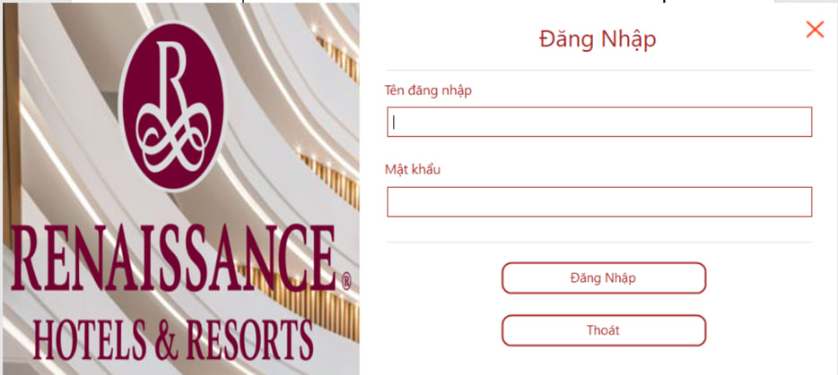

* Sau khi đăng nhập, màn hình sẽ hiện lên trang chủ. Tùy vào quyền đăng nhập mà có thể hoặc không thể thực hiện các chức năng ở trang chủ.

  

* Giao diện đặt phòng

  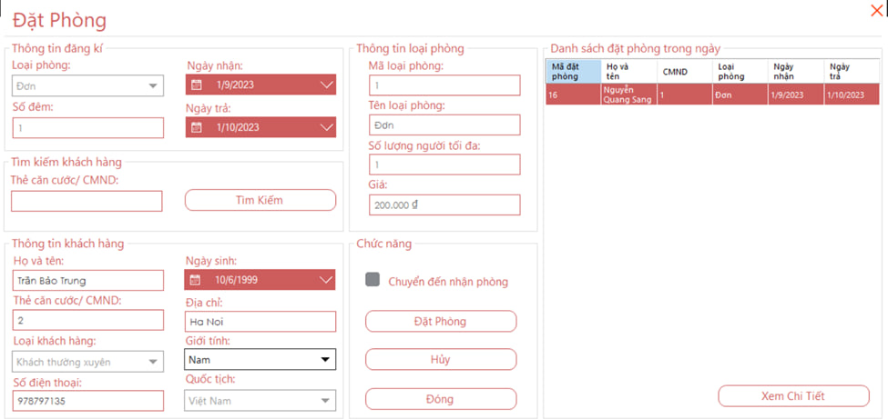

* Giao diện nhận phòng

  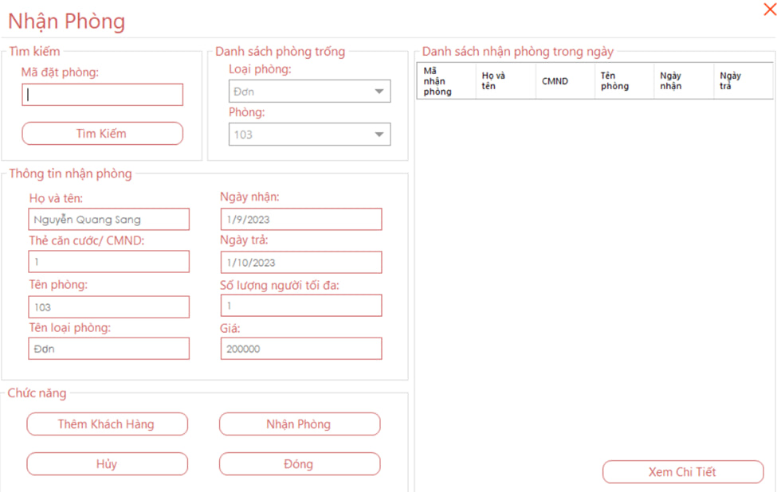

* Giao diện quản lí phòng

  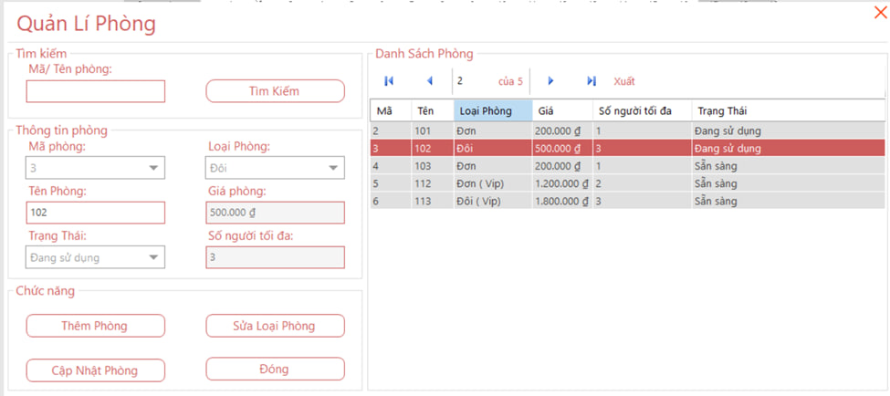

  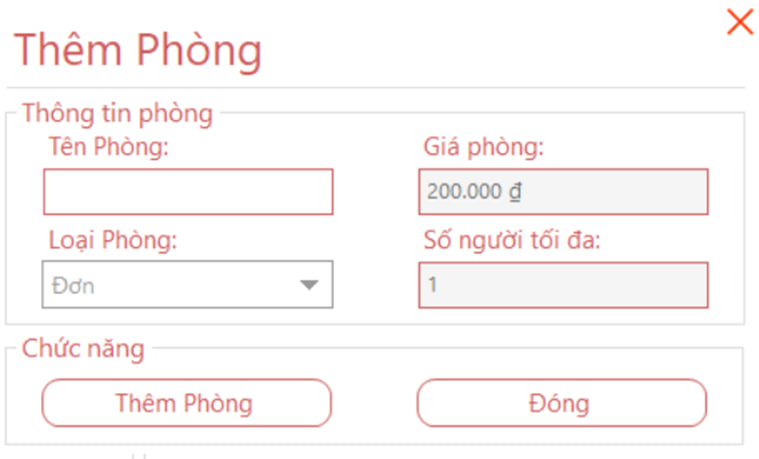

* Giao diện quản lí nhân viên

  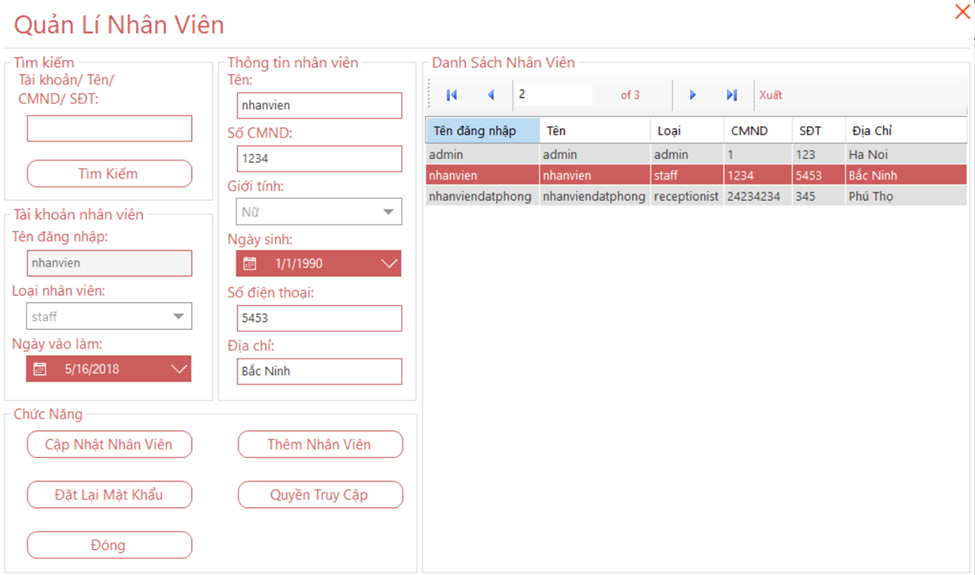

  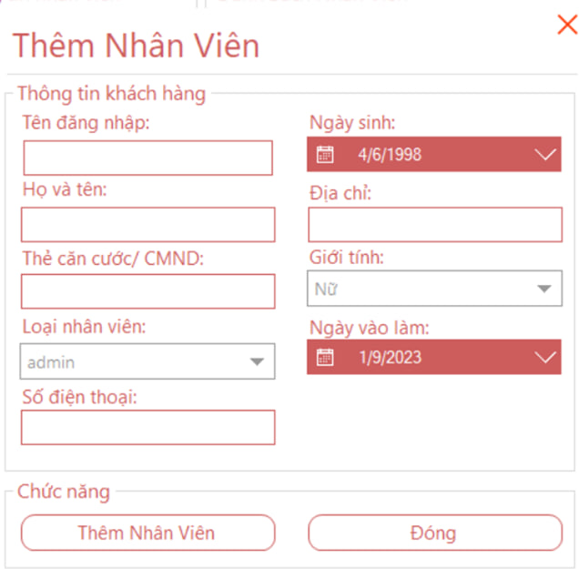

* Giao diện quản lí hóa đơn

  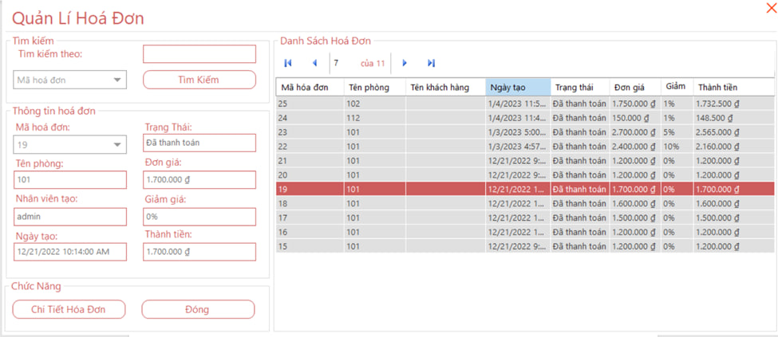

  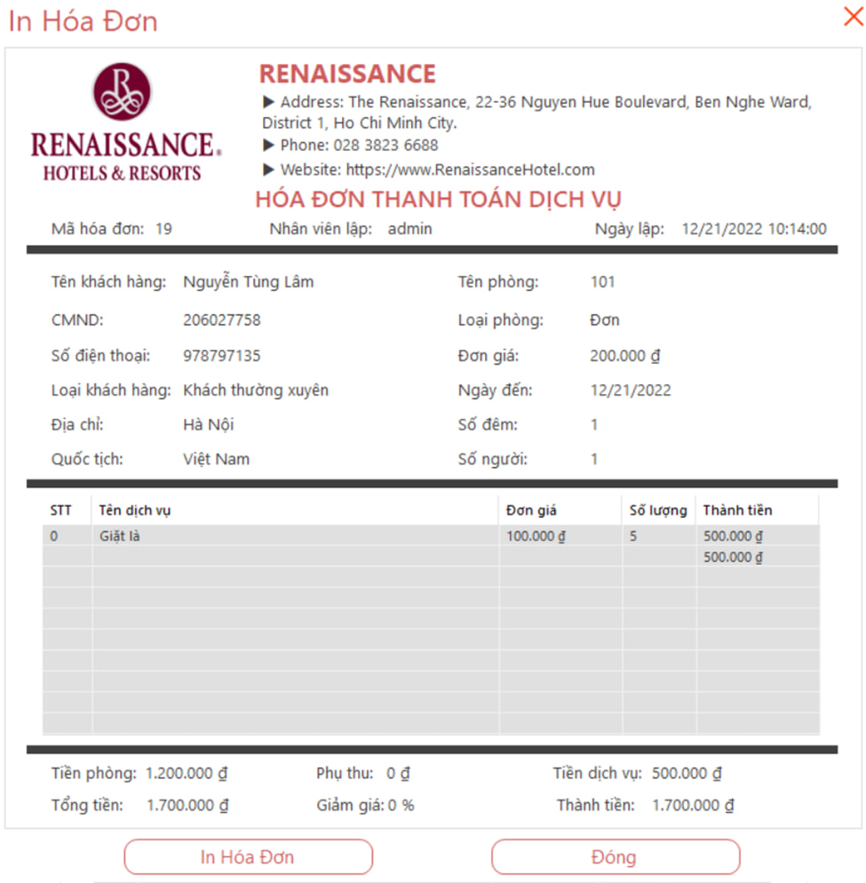

  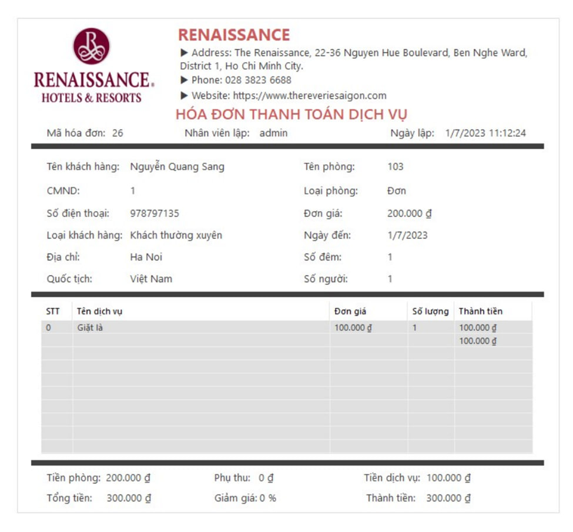

* Giao diện quản lí khách hàng

  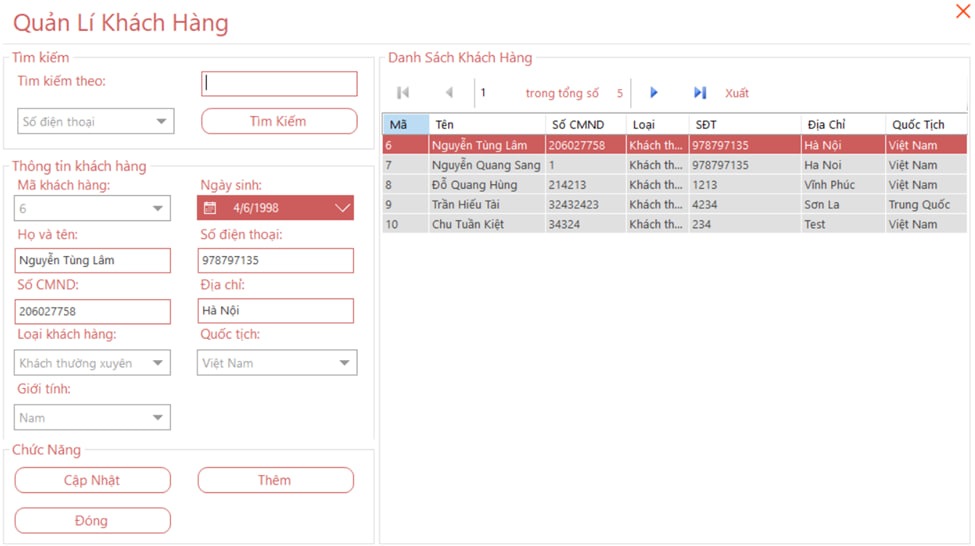

  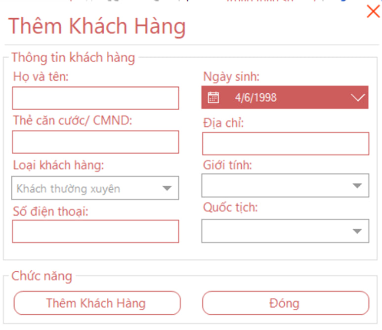

* Quản lí dịch vụ

  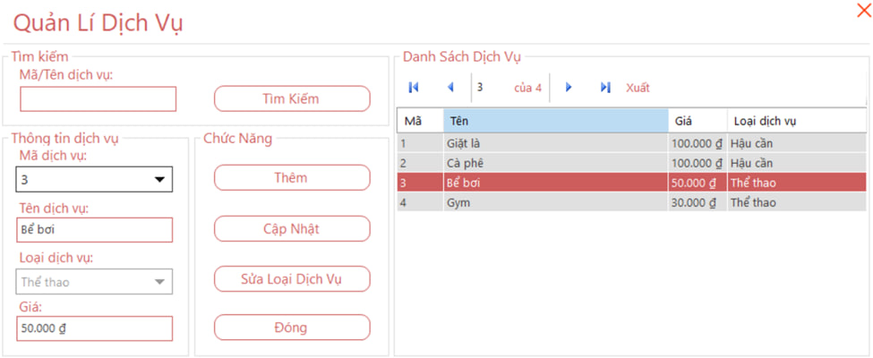

* Giao diện quy định

  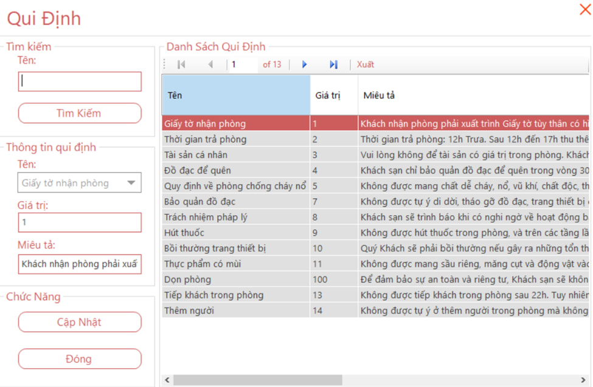

* Giao diện thông tin cá nhân

  

## Tài liệu tham khảo

Tai liệu hỗ trợ việc sử dụng C# [documentation](https://docs.microsoft.com/en-us/dotnet/csharp/).

## Bugs và các vấn đề

Bạn có câu hỏi hoặc vấn đề với dự án? [Đặt câu hỏi](https://github.com/trung501/thuc-tap-nhom/issues) tại đây trên Github.

